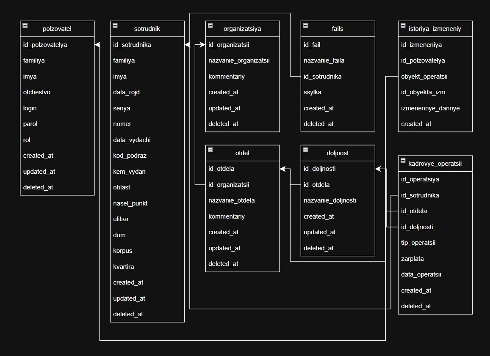

Схема базы данных :

Инструментарий для реализации проекта:
-* Visual Studio Code
-* Windows 11 и Docker Desktop
-* PostgreSQL 18

Основные команды Git:

git init - 
git clone - скачать репозиторий
git commit - сохранение версии файла
git commit -m "название" - сохранение с текстовым примечанием/подписью
git add - сохранение части файлов

git reset -