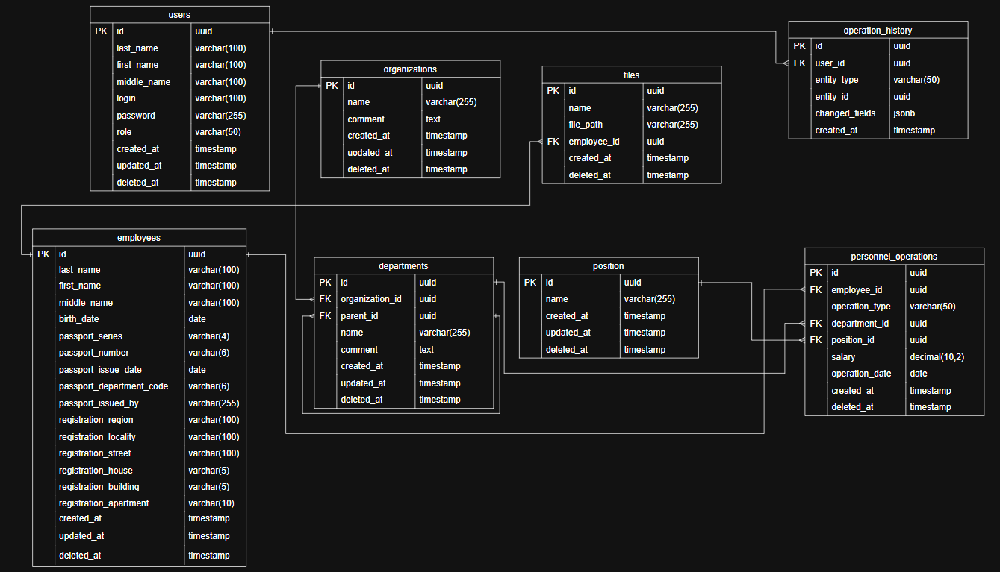

Схема базы данных :

то же самое, только по ссылке: https://drive.google.com/file/d/1agFge1Z8YKuF5RD7OqwnQm0os24pGxoO/view?usp=sharing 

типы данных:
1. organizations:
    id - UUID
    name - VARCHAR(255) not null
    comment - TEXT
    created_at - timestamp
    updated_at - timestamp
    deleted_at - timestamp
2. departments:
    id - UUID
    organization_id - UUID
    parent_id -UUID
    name - VARCHAR(255) not null
    comment - TEXT
    created_at - timestamp
    updated_at - timestamp
    deleted_at - timestamp
3. positions:
    id - UUID
    name - VARCHAR(255) not null
    created_at - timestamp
    updated_at - timestamp
    deleted_at - timestamp
4. employees:
    id - UUID
    last_name - VARCHAR(100) not null
    first_name - VARCHAR(100) not null
    middle_name - VARCHAR(100)
    birth_date - DATE not null
    password_series - VARCHAR(4) not null
    password_number - VARCHAR(6) not null
    password_issue_date - DATE not null
    password_department_code - VARCHAR(6) not null
    password_issued_by - VARCHAR(255) not null
    registration_region - VARCHAR(100) not null
    registration_locality - VARCHAR(100) not null
    registration_street - VARCHAR(100) not null
    registration_house - VARCHAR(5) not null
    registration_building - VARCHAR(5)
    registration_apartment - VARCHAR(10) 
    created_at - timestamp
    updated_at - timestamp
    deleted_at - timestamp
5. files:
    id - UUID
    name - VARCHAR(255) not null
    file_path - VARCHAR(255) not null
    created_at - timestamp
    deleted_at - timestamp
6. personnel_operations:
    id - UUID
    employee_id - UUID
    operation_type  - VARCHAR(50) not null
    department_id - UUID
    position_id - UUID
    salary - DECIMAL(10,2)
    operation_date - date not null
    created_at - timestamp
    deleted_at - timestamp
7. users:
    id - UUID
    last_name - VARCHAR(100) not null
    first_name - VARCHAR(100) not null
    middle_name - VARCHAR(100) 
    login - VARCHAR(100) unique not null
    password - VARCHAR(255) not null
    role - VARCHAR(50) not null
    created_at - timestamp
    updated_at - timestamp
    deleted_at - timestamp
8. operation_history:
    id - UUID
    user_id - UUID
    entity_type - VARCHAR(50) not null
    entity_id - UUID not null
    changed_fields - JSONB not null
    created_at - timestamp
    

Инструментарий для реализации проекта:
    * Visual Studio Code
    * Windows 11 и Docker Desktop
    * PostgreSQL 18

Основные команды Git:

git init - создание нового репозитория 
git clone - скачать репозиторий 
git commit - сохранение версии файла 
git commit -m "название" - сохранение с текстовым примечанием/подписью 
git add - сохранение части файлов 
git branch - создание ветки 
git checkout - переход на ветку 
git push - с локального на гит 
git pull - скачать ветку git rebase - перенос коммитов с ветки на ветку 
git revert - отмена изменений коммита

проверка